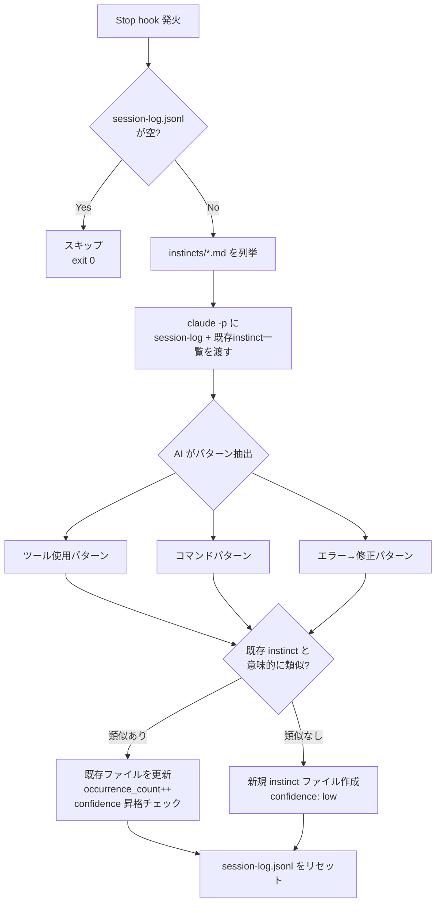
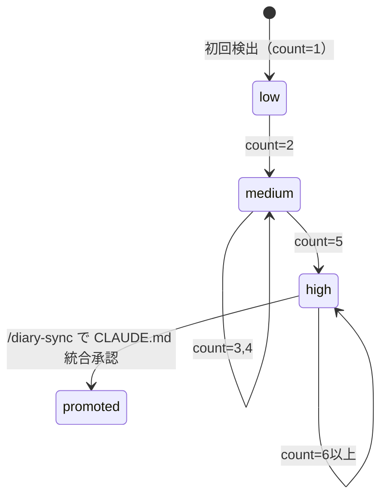

# auto-instinct-system データフロー図

**作成日**: 2026-03-23
**関連アーキテクチャ**: [architecture.md](architecture.md)
**関連要件定義**: [requirements.md](../../spec/auto-instinct-system/requirements.md)

---

## フロー1: セッションログ記録（PostToolUse） 🔵

**信頼性**: 🔵 *REQ-001〜003・ヒアリング確認済み*

```
[ツール実行]
     │
     ├── tool: Bash / Edit / Write / Read / Glob / Grep
     │
     ▼
PostToolUse Hook
     │
     ▼
instinct-logger.sh
     │
     ├── CLAUDE_TOOL_NAME を取得
     ├── CLAUDE_TOOL_INPUT を取得（機密情報マスキング）
     ├── CLAUDE_TOOL_RESULT から outcome 判定（success / error）
     │
     ▼
session-log.jsonl へ1行追記
{"timestamp":"2026-03-23T10:00:00Z","tool":"Bash","input_summary":"git status","outcome":"success","session_id":"abc123"}
```

**セッションログの1行フォーマット**:
```jsonc
{
  "timestamp": "ISO8601",       // 実行時刻
  "tool": "Bash",               // ツール名
  "input_summary": "git log",   // 入力の要約（機密除去済み、最大200文字）
  "outcome": "success",         // success | error
  "error_summary": "...",       // outcome=error の場合のみ
  "session_id": "abc123"        // セッション識別子
}
```

---

## フロー2: instinct 自動生成（Stop hook） 🔵

**信頼性**: 🔵 *REQ-010〜014・ヒアリング確認済み*



---

## フロー3: 信頼度自動昇格 🔵

**信頼性**: 🔵 *REQ-020〜022・ヒアリング確認済み*

```
instinct ファイル更新時:

occurrence_count が 1    → confidence: low
occurrence_count が 2〜4 → confidence: medium
occurrence_count が 5+   → confidence: high
```



---

## フロー4: diary-sync 統合（既存フロー拡張） 🔵

**信頼性**: 🔵 *REQ-030〜032・ヒアリング確認済み*

```
[/diary-sync 実行]
         │
         ├── learnings.md を読み込む（既存）
         └── instincts/*.md を読み込む（新規追加）
                    │
                    ├── confidence=high のみ CLAUDE.md 統合候補に優先提案
                    ├── confidence=medium は参考情報として表示
                    └── confidence=low は表示しない（ノイズフィルタ）
                    │
         ▼
    ユーザーに統合候補を提案
         │
    承認された instinct
         │
         ├── CLAUDE.md に追記
         └── instinct ファイルに promoted: true を付与
```

---

## フロー5: /evolve による手動管理 🟡

**信頼性**: 🟡 *REQ-040〜041 から妥当な推測*

```
[/evolve 実行]
      │
      ▼
instincts/*.md を全件読み込む
      │
      ▼
confidence 別に一覧表示:
  🟢 high:   [slug] (count: 8) 最終更新: 2026-03-20
  🟡 medium: [slug] (count: 3) 最終更新: 2026-03-18
  ⚪ low:    [slug] (count: 1) 最終更新: 2026-03-15
      │
      ▼
ユーザーが操作を選択:
  - 削除: ファイルを削除
  - 信頼度変更: frontmatter を手動更新
  - 内容確認: ファイルを表示
```

---

## エラーハンドリングフロー 🔵

**信頼性**: 🔵 *NFR-020〜021・diary-on-stop.sh パターンより*

```mermaid
flowchart TD
    A[instinct-on-stop.sh 実行] --> B{session-log\n存在 & 非空?}
    B -- No --> Z[exit 0\nサイレント終了]
    B -- Yes --> C[claude -p 実行]
    C --> D{成功?}
    D -- No --> E[エラーログ出力\nexit 0\nノンブロッキング終了]
    D -- Yes --> F[instinct ファイル生成/更新]
    F --> G{ファイル書き込み\n成功?}
    G -- No --> E
    G -- Yes --> H[session-log.jsonl リセット]
    H --> I[echo \"✨ instinct 更新完了\"]
    I --> J[exit 0]
```

---

## 関連文書

- **アーキテクチャ**: [architecture.md](architecture.md)
- **ファイルフォーマット**: [file-formats.md](file-formats.md)
- **設計ヒアリング**: [design-interview.md](design-interview.md)

## 信頼性レベルサマリー

- 🔵 青信号: 9件 (82%)
- 🟡 黄信号: 2件 (18%)
- 🔴 赤信号: 0件 (0%)

**品質評価**: ✅ 高品質
