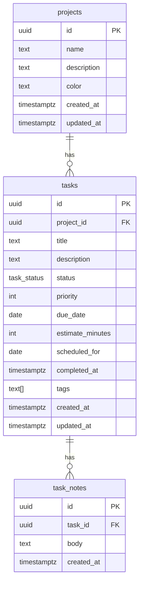

# データベース設計（逆生成）

**分析日時**: 2026-03-25
**マイグレーション履歴**: `supabase/migrations/`

---

## スキーマ概要

### テーブル一覧

| テーブル名 | 説明 | マイグレーション |
|---|---|---|
| `projects` | プロジェクト | `20260308075256_create_projects_table.sql` |
| `tasks` | タスク | `20260308075530_create_tasks_table.sql` |
| `task_notes` | タスクメモ | `20260308075613_create_task_notes_table.sql` |

### カスタム型

| 型名 | 値 | 説明 |
|---|---|---|
| `task_status` | `'todo' \| 'doing' \| 'done'` | タスクの状態を表す ENUM |

---

## ER 図



---

## テーブル詳細

### projects

```sql
CREATE TABLE projects (
  id          uuid        PRIMARY KEY DEFAULT gen_random_uuid(),
  name        text        NOT NULL,
  description text,
  color       text,
  created_at  timestamptz NOT NULL DEFAULT now(),
  updated_at  timestamptz NOT NULL DEFAULT now()
);
```

| カラム | 型 | 必須 | 説明 |
|---|---|---|---|
| `id` | uuid | ✓ | プライマリキー（自動生成） |
| `name` | text | ✓ | プロジェクト名 |
| `description` | text | | 説明文 |
| `color` | text | | カラーラベル（red/orange/yellow/green/blue/purple/pink） |
| `created_at` | timestamptz | ✓ | 作成日時（自動設定） |
| `updated_at` | timestamptz | ✓ | 更新日時（自動設定） |

---

### tasks

```sql
CREATE TYPE task_status AS ENUM ('todo', 'doing', 'done');

CREATE TABLE tasks (
  id               uuid        PRIMARY KEY DEFAULT gen_random_uuid(),
  project_id       uuid        NOT NULL REFERENCES projects(id) ON DELETE CASCADE,
  title            text        NOT NULL,
  description      text,
  status           task_status NOT NULL DEFAULT 'todo',
  priority         int,
  due_date         date,
  estimate_minutes int,
  scheduled_for    date,
  completed_at     timestamptz,
  tags             text[]      NOT NULL DEFAULT '{}',
  created_at       timestamptz NOT NULL DEFAULT now(),
  updated_at       timestamptz NOT NULL DEFAULT now()
);
```

| カラム | 型 | 必須 | 説明 |
|---|---|---|---|
| `id` | uuid | ✓ | プライマリキー（自動生成） |
| `project_id` | uuid | ✓ | 所属プロジェクト（CASCADE 削除） |
| `title` | text | ✓ | タスク名 |
| `description` | text | | 詳細説明 |
| `status` | task_status | ✓ | 状態（default: `'todo'`） |
| `priority` | int | | 優先度（1〜5、小さいほど高優先） |
| `due_date` | date | | 期日 |
| `estimate_minutes` | int | | 見積時間（分） |
| `scheduled_for` | date | | 作業予定日（Today ビューで使用） |
| `completed_at` | timestamptz | | 完了日時（status=done 時に自動設定） |
| `tags` | text[] | ✓ | タグ配列（default: `{}` 空配列） |
| `created_at` | timestamptz | ✓ | 作成日時 |
| `updated_at` | timestamptz | ✓ | 更新日時 |

---

### task_notes

```sql
CREATE TABLE task_notes (
  id         uuid        PRIMARY KEY DEFAULT gen_random_uuid(),
  task_id    uuid        NOT NULL REFERENCES tasks(id) ON DELETE CASCADE,
  body       text        NOT NULL,
  created_at timestamptz NOT NULL DEFAULT now()
);
```

| カラム | 型 | 必須 | 説明 |
|---|---|---|---|
| `id` | uuid | ✓ | プライマリキー（自動生成） |
| `task_id` | uuid | ✓ | 所属タスク（CASCADE 削除） |
| `body` | text | ✓ | メモ本文 |
| `created_at` | timestamptz | ✓ | 作成日時 |

---

## 制約・カスケード

| 制約 | 内容 |
|---|---|
| `tasks.project_id` → `projects.id` | ON DELETE CASCADE（プロジェクト削除時にタスクも削除） |
| `task_notes.task_id` → `tasks.id` | ON DELETE CASCADE（タスク削除時にメモも削除） |

---

## 主要クエリパターン

### listTodayTasks

```sql
SELECT tasks.*, projects.name, projects.color
FROM tasks
JOIN projects ON tasks.project_id = projects.id
WHERE (tasks.scheduled_for = :today OR tasks.due_date = :today)
  AND tasks.status != 'done'
ORDER BY tasks.priority ASC NULLS LAST;
```

### listStalledTasks

```sql
SELECT tasks.*, projects.name, projects.color
FROM tasks
JOIN projects ON tasks.project_id = projects.id
WHERE tasks.status = 'doing'
  AND tasks.updated_at < now() - INTERVAL ':thresholdDays days';
```

### listRecentCompleted

```sql
SELECT tasks.*, projects.name, projects.color
FROM tasks
JOIN projects ON tasks.project_id = projects.id
WHERE tasks.status = 'done'
ORDER BY tasks.completed_at DESC
LIMIT 30;
```
