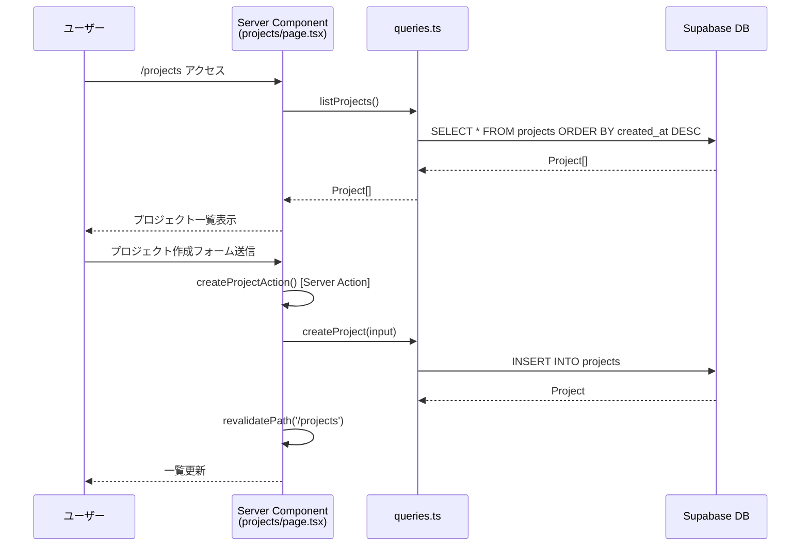
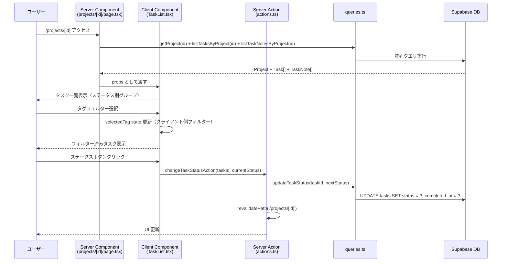
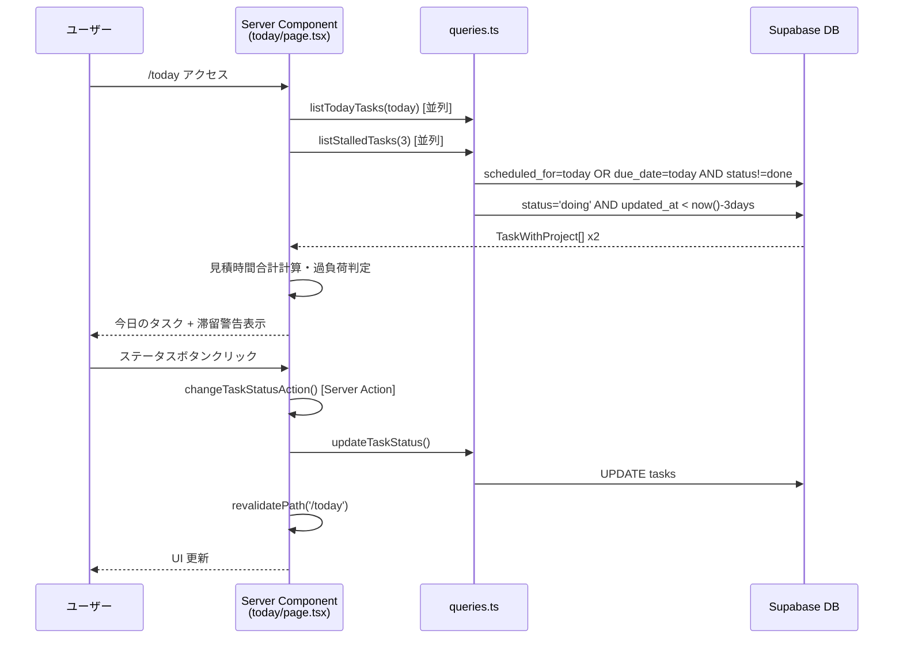
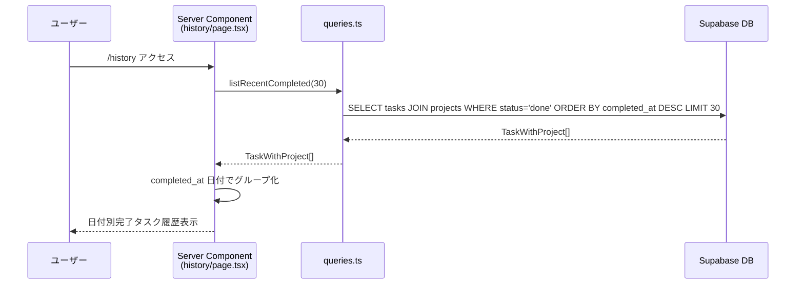

# データフロー図（逆生成）

**分析日時**: 2026-03-25

---

## 基本データフロー

すべての操作は以下の単方向フローで実装されている。

```
ユーザーアクション
  → Server Action（バリデーション + DB 操作）
    → Supabase Admin Client
      → PostgreSQL
    → revalidatePath()
      → Next.js ISR キャッシュ無効化
        → Server Component 再レンダリング
          → UI 更新
```

---

## 画面別データフロー

### 1. プロジェクト一覧 (`/projects`)



### 2. プロジェクト詳細 (`/projects/[id]`)



### 3. Today ビュー (`/today`)



### 4. History ビュー (`/history`)



---

## ステータス遷移フロー

```
todo ──クリック──► doing ──クリック──► done ──クリック──► todo
  ↑                                      │
  └──────────────────────────────────────┘
         (completed_at = null)    (completed_at = now())
```

### 実装詳細

```typescript
const NEXT_STATUS = {
  todo: "doing",
  doing: "done",
  done: "todo",
} as const;

// done 以外: completed_at = null
// done: completed_at = now()
```

---

## エラーハンドリングフロー

現状の実装では明示的なエラーハンドリング UI はなく、Server Action のエラーは Next.js のデフォルト動作に委ねられている。

```
Server Action 実行
  → 成功: revalidatePath() → UI 更新
  → 失敗: Next.js エラーバウンダリ（error.tsx 未実装）
```

---

## クライアント側状態管理

`TaskList.tsx` 内のローカル状態（グローバルストアなし）：

| 状態 | 型 | 用途 |
|---|---|---|
| `editing` | `string \| null` | 編集中のタスク ID |
| `showNotes` | `string \| null` | メモ表示中のタスク ID |
| `selectedTag` | `string \| null` | タグフィルター選択値 |
| `isPending` | `boolean` | `useTransition` のペンディング状態 |
